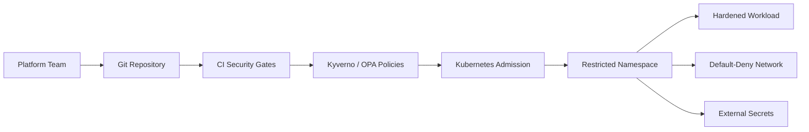

# Secure Kubernetes Platform Hardening

[](https://github.com/mrsddq/secure-kubernetes-platform-hardening/actions/workflows/ci.yml)

Kubernetes security portfolio repo focused on platform guardrails: namespace hardening, NetworkPolicies, least-privilege RBAC, Pod Security Standards, Kyverno policies, OPA examples, secret delivery, image scanning, and CI security gates.

## What This Builds

- Hardened namespace baseline with Pod Security Standards labels
- Default-deny ingress and egress NetworkPolicies
- Approved DNS and HTTPS egress policy examples
- Least-privilege service account, Role, and RoleBinding
- Secure sample workload with non-root runtime, probes, resources, and read-only filesystem
- Kyverno policies for image pinning, non-root execution, resource limits, and privilege controls
- OPA Gatekeeper-style Rego examples for admission policy discussion
- External Secrets and Sealed Secrets templates
- CI validation for repo structure and policy coverage

## Architecture



## Local Validation

```bash
make validate
```

Optional cluster-side checks:

```bash
kubectl apply --dry-run=server -f kubernetes/base/namespace.yaml
kubectl apply --dry-run=server -f policies/kyverno/
```

## Portfolio Evidence

See [docs/PORTFOLIO_EVIDENCE.md](docs/PORTFOLIO_EVIDENCE.md) for validation commands, control mapping, and interview proof points.

## What This Proves

- Understands Kubernetes platform security controls
- Can write least-privilege RBAC and network isolation policies
- Knows how admission control fits into CI/CD and GitOps
- Understands secret management patterns without committing secret values
- Can document practical security exceptions and runbooks

## Safe Demo Note

The repo contains templates and policies only. No secrets, cluster credentials, or production hostnames are included.
