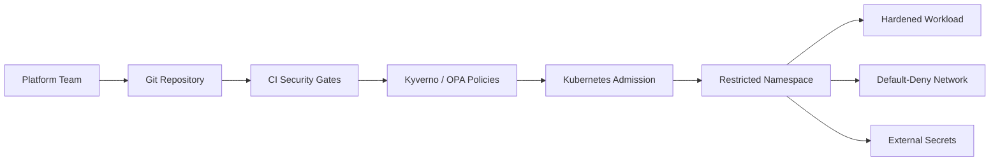

# Secure Kubernetes Platform Hardening

[](https://github.com/mrsddq/secure-kubernetes-platform-hardening/actions/workflows/ci.yml)

Kubernetes security portfolio repo focused on platform guardrails: namespace hardening, NetworkPolicies, least-privilege RBAC, Pod Security Standards, Kyverno policies, OPA examples, secret delivery, image scanning, and CI security gates.

## What This Builds

- Hardened namespace baseline with Pod Security Standards labels
- Default-deny ingress and egress NetworkPolicies
- Approved DNS and HTTPS egress policy examples
- Least-privilege service account, Role, and RoleBinding
- Secure sample workload with non-root runtime, probes, resources, and read-only filesystem
- Kyverno policies for SHA-256 image-digest pinning across regular/init/ephemeral containers, non-root execution, resource limits, and privilege controls
- Standalone OPA v1 policies for raw Pod objects and AdmissionReview input
- External Secrets and Sealed Secrets templates
- CI validation plus executable positive/negative Kyverno and OPA policy tests

## Architecture


```mermaid
flowchart LR
    Dev["Platform Team"] --> Git["Git Repository"]
    Git --> CI["CI Security Gates"]
    CI --> Policies["Kyverno / OPA Policies"]
    Policies --> Admission["Kubernetes Admission"]
    Admission --> Namespace["Restricted Namespace"]
    Namespace --> Workload["Hardened Workload"]
    Namespace --> Network["Default-Deny Network"]
    Namespace --> Secrets["External Secrets"]
```

## Local Validation

```bash
python -m pip install -r requirements-dev.txt
make validate
# Requires OPA 1.8.0 and Kyverno CLI 1.15.2 on PATH:
make policy-test
```

Optional cluster-side checks:

```bash
kubectl apply --dry-run=server -f kubernetes/base/namespace.yaml
kubectl apply --dry-run=server -f policies/kyverno/
```

## Portfolio Evidence

See [docs/PORTFOLIO_EVIDENCE.md](docs/PORTFOLIO_EVIDENCE.md) for validation commands, control mapping, and interview proof points.

## What This Proves

- Understands Kubernetes platform security controls
- Can write least-privilege RBAC and network isolation policies
- Knows how admission control fits into CI/CD and GitOps
- Understands secret management patterns without committing secret values
- Can document practical security exceptions and runbooks

## Safe Demo Note

The repo contains templates and policies only. No secrets, cluster credentials, or production hostnames are included.

## What the regression suite checks

`make policy-test` uses the actual OPA and Kyverno engines without cluster credentials. The Kyverno fixtures derive a Pod from the sample Deployment, then mutate it to exercise untagged/latest/version-tag images, invalid digests, unsafe init/debug containers, missing privilege controls, root overrides, missing CPU limits, and missing readiness probes. Each fixture declares expected pass/fail results for every rule. OPA tests cover both raw Pod and AdmissionReview input shapes and check missing security fields fail closed.

The legacy `disallow-latest-images.yaml` filename is retained, but the policy now requires a full SHA-256 digest. A version tag is mutable and does not satisfy that rule. A digest pins content; it does not attest that the image is signed or vulnerability-free. OPA is a standalone decision policy and is **not** an installed admission webhook or Gatekeeper constraint.

## Runtime and network assumptions

- The sample uses the NGINX unprivileged image pinned to an OCI index digest resolved from the registry. The read-only root filesystem has a bounded writable `/tmp` volume for PID/cache files, following the [upstream runtime layout](https://github.com/nginx/docker-nginx-unprivileged). Refresh and scan the digest before deployment.
- DNS is limited to pods labeled `k8s-app: kube-dns` in `kube-system`. Adapt this for NodeLocal DNS or different CNI/DNS labels. Ingress requires both the `ingress-nginx` namespace and controller pod labels.
- NetworkPolicy requires a supporting CNI. The opt-in HTTPS egress policy allows **any destination on TCP 443** for pods labeled `egress: internet`; standard NetworkPolicy cannot enforce hostname allowlists.
- The secret manifests are alternative templates. Do not apply both to the same target Secret; install/configure the relevant controller first.
- Admission engines are tested locally; no cluster deployment, image runtime smoke test, signature verification, or live network isolation test is claimed. Trivy remains advisory (`exit-code: 0`); behavioral admission regressions are blocking in CI.

See [Kyverno container-list patterns](https://kyverno.io/policies/other/restrict-deprecated-registry/restrict-deprecated-registry/) for the combined regular/init/ephemeral traversal used here.
